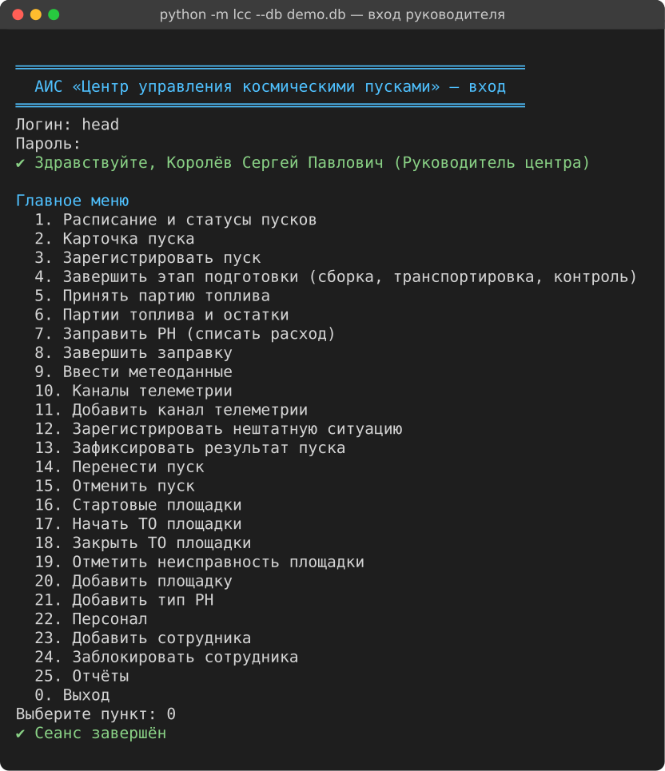
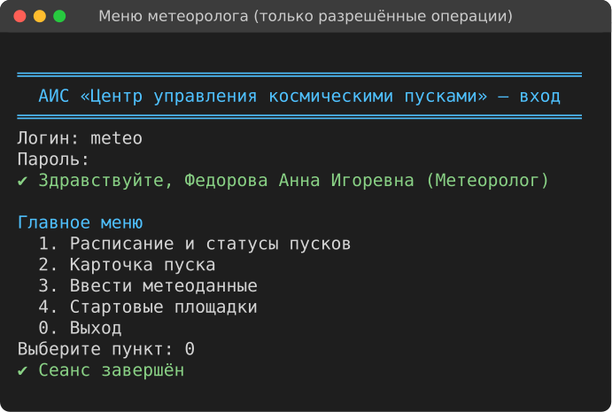
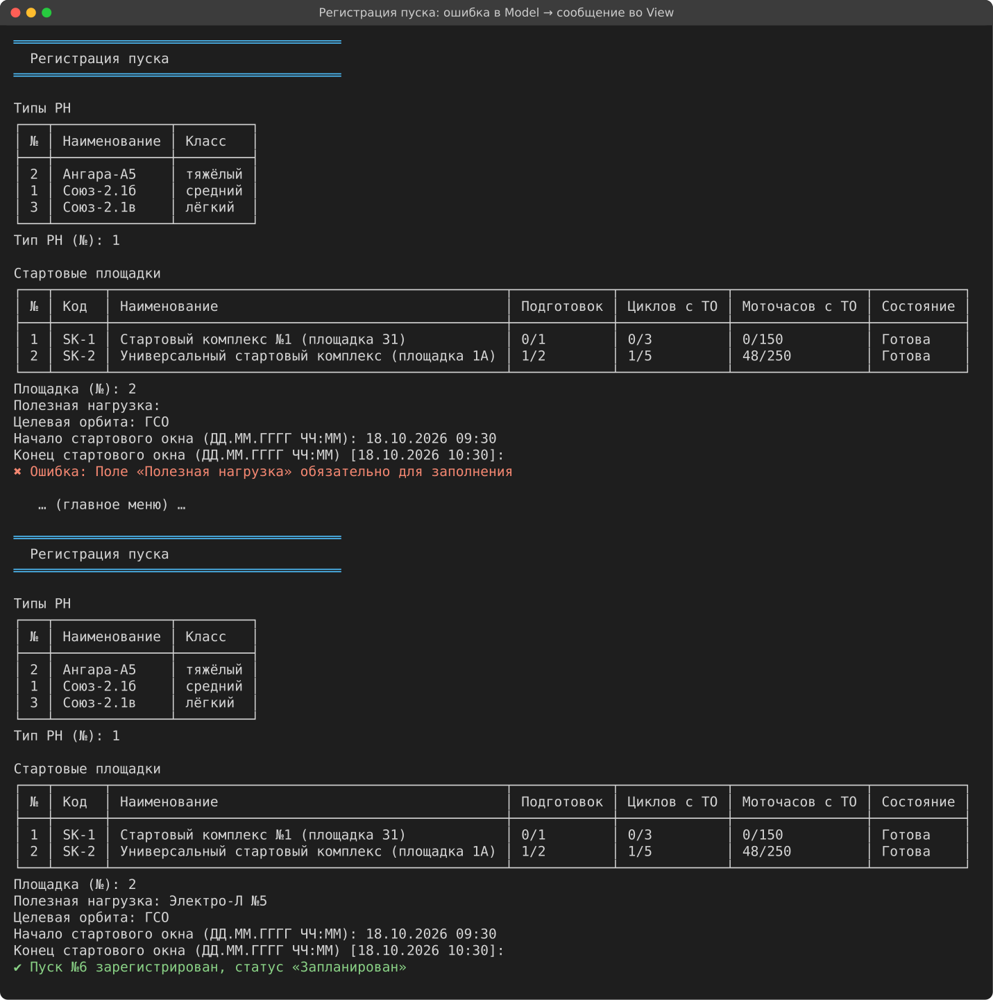
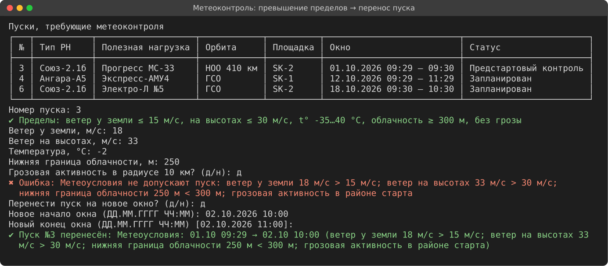
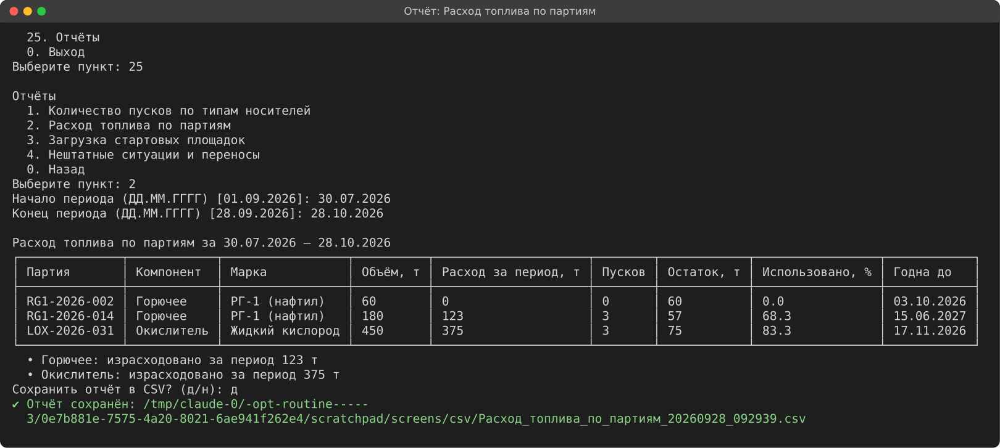

# АИС «Центр управления космическими пусками» (Spaceport LCC)

Учётная информационная система наземной инфраструктуры космодрома: регистрация пусков
ракет-носителей, поэтапная подготовка, учёт топлива по партиям, загрузка и обслуживание
стартовых площадок, метеообеспечение, телеметрический контроль и отчётность.

Лабораторная работа №3 «Прямое проектирование: от описания к моделям и коду», вариант 3.

> README дополняется по мере работы; журнал ключевых решений — в конце файла.

## Быстрый старт

Требуется только **Python 3.10+** (сторонние библиотеки не нужны, БД — встроенный SQLite).

```bash
git clone https://github.com/r3DBAD/SpaceCenter.git && cd SpaceCenter

python -m lcc --db demo.db --demo      # создать демо-базу (справочники, 5 сотрудников, история пусков)
python -m lcc --db demo.db             # запустить; вход, например: head / demo2026

python -m lcc --db work.db --init      # пустая рабочая база: создать учётную запись руководителя
python -m lcc --db work.db

python -m unittest discover -s tests   # тесты (модель, сервисы, сквозной сценарий)
```

| Логин (демо) | Роль | Что попробовать |
|---|---|---|
| `head` | Руководитель центра | регистрация пуска, результат пуска, отчёты, персонал |
| `engineer` | Инженер ТК | завершение этапов сборки/транспортировки/контроля, ТО площадок |
| `fuel` | Инженер по заправке | приём партии, заправка пуска №3, закрытие заправки |
| `meteo` | Метеоролог | метеоданные: при шторме система предложит перенос |
| `telemetry` | Оператор телеметрии | каналы, регистрация НС |

Пароль всех демо-пользователей — `demo2026` (только для демо-базы).

---

## Скриншоты

| Вход и меню руководителя | Меню метеоролога (по правам роли) |
|---|---|
|  |  |

Регистрация пуска: ошибка валидации в Model → понятное сообщение во View, затем успешная регистрация:



Метеоконтроль: превышение пределов → перенос пуска:



Отчёт «Расход топлива по партиям»:



---

## 1. Предметная область

Центр управления осуществляет подготовку и проведение пусков ракет-носителей (РН). Каждый
пуск регистрируется с указанием типа носителя, полезной нагрузки, целевой орбиты, даты и
времени стартового окна. Подготовка проходит поэтапно: доставка и сборка ракеты на
техническом комплексе (ТК), транспортировка на стартовый комплекс (СК), заправка
компонентами топлива, предстартовый контроль систем. Топливо (горючее, окислитель)
учитывается по партиям с контролем сроков годности, расход фиксируется по каждому пуску.
Стартовые площадки имеют ограничение по количеству одновременных подготовок и требуют
межпускового обслуживания по нормативам моточасов и циклов. Телеметрия ведётся по
каналам, закреплённым за системами носителя; потеря сигнала — нештатная ситуация (НС).
При превышении предельных метеоусловий пуск переносится с фиксацией причины.

## 2. Исходные требования

### 2.1. Сущности (объекты учёта)

| Группа | Сущность | Что фиксируем |
|---|---|---|
| Люди | **Сотрудник** (`Staff`) | ФИО, роль, логин, хеш пароля |
| Объекты | **Тип РН** (`VehicleType`) | наименование, класс (лёгкий/средний/тяжёлый), число ступеней, требуемые компоненты топлива |
| | **Стартовая площадка** (`LaunchPad`) | код, наименование, макс. число одновременных подготовок, норматив циклов и моточасов до ТО, текущие циклы/моточасы, состояние |
| | **Партия топлива** (`FuelBatch`) | номер партии, компонент (горючее/окислитель), марка, объём, остаток, дата изготовления, срок годности |
| | **Телеметрический канал** (`TelemetryChannel`) | номер, система РН (ДУ, СУ, СЭС, ТР…), параметр, частота опроса, Гц |
| События | **Пуск** (`Launch`) | тип РН, полезная нагрузка, целевая орбита, площадка, начало/конец стартового окна, статус |
| | **Этап подготовки** (`PreparationStage`) | пуск, вид этапа, начало, окончание, ответственный, результат |
| | **Расход топлива** (`FuelConsumption`) | пуск, партия, объём, дата, ответственный |
| | **Межпусковое обслуживание** (`PadMaintenance`) | площадка, вид работ (осмотр/ремонт/замена агрегатов), плановая/фактическая дата, моточасы |
| | **Метеонаблюдение** (`WeatherObservation`) | пуск, время, ветер у земли и на высотах, температура, облачность (нижняя граница), грозовая активность |
| | **Нештатная ситуация** (`Incident`) | пуск, канал, время, описание, принятые меры |
| Документы | **Перенос пуска** (`Postponement`) | пуск, причина (метео/техника/НС/прочее), старое и новое окно, комментарий |
| | **Отчёты** | формируются по запросу, не хранятся (вычисляются из данных) |

### 2.2. Процессы

1. **Регистрация пуска** — ввод параметров, проверка окна и доступности площадки.
2. **Подготовка к пуску** — последовательное прохождение этапов:
   `Сборка на ТК → Транспортировка на СК → Заправка → Предстартовый контроль`.
3. **Учёт топлива** — приём партий, контроль сроков годности, списание расхода на пуск при заправке.
4. **Обслуживание стартовых площадок** — учёт циклов и моточасов, планирование и закрытие ТО.
5. **Метеообеспечение** — ввод метеоданных, автоматическая проверка предельных значений,
   решение «пуск разрешён / перенос».
6. **Проведение пуска и телеметрический контроль** — фиксация пуска, потерь сигнала по каналам (НС).
7. **Отчётность** — сводные отчёты для руководителя.

### 2.3. Роли и права

| Действие | Руководитель центра | Инженер ТК | Инженер по заправке | Метеоролог | Оператор телеметрии |
|---|:-:|:-:|:-:|:-:|:-:|
| Регистрация / изменение / отмена пуска | ✔ | — | — | — | — |
| Просмотр расписания пусков | ✔ | ✔ | ✔ | ✔ | ✔ |
| Отметка этапов «Сборка», «Транспортировка», «Предстартовый контроль» | ✔ | ✔ | — | — | — |
| Приём партий топлива, этап «Заправка», списание расхода | ✔ | — | ✔ | — | — |
| Площадки: создание, ТО | ✔ | ✔ | — | — | — |
| Ввод метеоданных, решение о переносе по метео | ✔ | — | — | ✔ | — |
| Каналы телеметрии, регистрация НС | ✔ | — | — | — | ✔ |
| Фиксация результата пуска | ✔ | — | — | — | — |
| Формирование отчётов | ✔ | — | — | — | — |
| Управление персоналом | ✔ | — | — | — | — |

Удаление фактов (расход, НС, переносы) не допускается никому — только добавление записей (аудит).

### 2.4. Правила и ограничения

**Статусы пуска и переходы**

```
Запланирован → Сборка на ТК → Транспортировка на СК → Заправка → Предстартовый контроль → Готов к пуску → Выполнен
                                                                                                        ↘ Авария
Любой нефинальный статус → Отменён.  Перенос — событие: окно сдвигается, статус подготовки сохраняется
```

* Этапы подготовки идут строго по порядку, пропуск этапа невозможен.
* Обязательные поля пуска: тип РН, полезная нагрузка, орбита, площадка, начало и конец окна.
* Стартовое окно: `начало < конец`, длительность от 1 минуты до 24 часов, при регистрации — не в прошлом.
* **Площадка:** число пусков в активной подготовке (статусы от «Сборка на ТК» до «Готов к пуску»)
  не больше `max_concurrent`; на площадку в состоянии «На обслуживании» / «Неисправна» нельзя
  назначить подготовку; после каждого пуска `cycles += 1`; при достижении норматива циклов или моточасов
  площадка автоматически переводится в статус «Требует ТО» и блокируется до закрытия обслуживания.
* **Топливо:** списывать можно только из партии нужного компонента, не просроченной на дату заправки,
  объём `> 0` и не больше остатка; этап «Заправка» закрывается только при наличии расхода и горючего, и окислителя.
* **Метео (предельные значения по умолчанию, настраиваются):** ветер у земли ≤ 15 м/с,
  ветер на высотах ≤ 30 м/с, температура от −35 до +40 °C, нижняя граница облачности ≥ 300 м,
  отсутствие грозы в радиусе 10 км. При нарушении любого — перенос с причиной «метео».
* **Телеметрия:** потеря сигнала по каналу фиксируется как НС (время, канал, меры). Частота канала > 0.
* Числовые значения неотрицательны; строки обязательных полей непустые — проверка на уровне Model.

### 2.5. Отчётность

| Отчёт | Содержание | Вид |
|---|---|---|
| Пуски по типам носителей | количество пусков за период по типам РН и статусам (выполнено/авария/перенесено) | таблица |
| Расход топлива по партиям | партия, компонент, начальный объём, израсходовано, остаток, % использования, срок годности | таблица |
| Загрузка стартовых площадок | число подготовок и пусков за период, дни занятости, % загрузки, циклы до ТО | таблица |
| НС и переносы | количество НС и переносов, детализация переносов по причинам | таблица + итог |

Все отчёты — за произвольный период `[с; по]`, выводятся в консоль и экспортируются в CSV.

---

## 3. Модели системы

| # | Модель | Документ |
|---|---|---|
| 1 | IDEF0 — функциональная модель (A-0, A0, A2) | [docs/01_idef0.md](docs/01_idef0.md) |
| 2 | UseCase и диаграммы последовательности | [docs/02_usecase_sequence.md](docs/02_usecase_sequence.md) |
| 3 | DFD (Гейн–Сарсон): контекст и уровень 1 | [docs/03_dfd.md](docs/03_dfd.md) |
| 4 | IDEF1X — модель данных | [docs/04_idef1x.md](docs/04_idef1x.md) |
| 5 | Архитектура MVC, диаграммы классов, статусная модель | [docs/05_architecture.md](docs/05_architecture.md) |
| 6 | Аудит собственного кода | [docs/06_audit.md](docs/06_audit.md) |
| — | Документация кода (pdoc, HTML) | [docs/api/index.html](docs/api/index.html) — генерация: `tools/gen_docs.sh` |

## 4. Архитектура (MVC)

```
lcc/
├── model/            # Model: вся бизнес-логика и данные
│   ├── enums.py         статусы, роли, матрица прав ROLE_PERMISSIONS
│   ├── validation.py    проверки полей (пустые строки, диапазоны, даты)
│   ├── entities.py      Staff, VehicleType, LaunchPad, Launch, LaunchWindow, FuelBatch, TelemetryChannel
│   ├── stages.py        этапы подготовки (A21–A24) — полиморфные проверки завершения
│   ├── weather.py       WeatherObservation, WeatherLimits (предельные метеоусловия)
│   ├── journal.py       JournalRecord → Incident, Postponement
│   ├── security.py      PasswordHasher (PBKDF2), Session.require(permission)
│   ├── schema.sql       схема SQLite по модели IDEF1X
│   ├── database.py      соединение, транзакции
│   ├── repositories.py  DAO — только параметризованные запросы
│   ├── services.py      сценарии: регистрация, этапы, заправка, метео, НС, ТО, персонал
│   └── reports.py       Report → 4 отчёта, Period, ReportTable
├── view/             # View: только ввод-вывод
│   ├── base.py          интерфейс View
│   ├── console.py       ConsoleView (меню, формы, таблицы)
│   └── csv_export.py    экспорт отчёта в CSV
├── controller/       # Controller: View ↔ Model
│   ├── base.py          BaseController.safe() — ошибки Model → View.show_error
│   ├── app.py           вход, главное меню по правам роли
│   ├── launch_controller.py, operations.py, admin.py
├── seed.py           # демо-данные (создаются через сервисы — с соблюдением всех правил)
└── __main__.py       # точка входа
tests/                # unittest: модель, сервисы, e2e через AppController + ScriptedView
```

**Взаимодействие слоёв.** View → (действие пользователя) → Controller → `Services.<сервис>.<метод>(session, …)` →
сущности и репозитории Model → результат (сущность / DTO) или исключение `DomainError` → Controller →
`View.show_table / show_message / show_error`. Controller зависит от абстракции `View`, поэтому в тестах
вместо консоли подставляется `ScriptedView`. Подробно — [docs/05_architecture.md](docs/05_architecture.md).

**Реализованные сквозные сценарии (MVP):**

| # | Сценарий | Роль | Правила Model |
|---|---|---|---|
| S1 | Вход в систему | все | PBKDF2, блокировка после 5 ошибок, меню по правам |
| S2 | Регистрация пуска | руководитель | обязательные поля, окно 1 мин–24 ч и не в прошлом, площадка исправна и не перегружена |
| S3 | Подготовка по этапам + заправка по партиям | инженер ТК, инженер по заправке | строгий порядок этапов, срок годности и остаток партии, оба компонента топлива |
| S4 | Метеоконтроль → допуск или перенос | метеоролог | предельные значения, свежесть данных ≤ 3 ч, перенос только вперёд |
| S5 | Телеметрия (НС) и результат пуска | оператор ТМ, руководитель | пуск только из «Готов к пуску» в окне; +1 цикл площадки → «Требует ТО» |
| S6 | Отчёты (4 вида) + CSV | руководитель | период с ≤ по; показатели вычисляются, не хранятся |

---

## Журнал решений

| # | Решение | Обоснование |
|---|---|---|
| 1 | Вариант 3 — «Центр управления космическими пусками» | выбор группы |
| 2 | Роли выделены по участкам работ ЦУП (ТК, заправка, метео, телеметрия) + руководитель | соответствует процессам предметной области |
| 3 | Отчёты не хранятся, а вычисляются | исключение избыточности данных |
| 4 | IDEF0 рисуется генератором SVG на бланке Р 50.1.028-2001, Mermaid/PlantUML — дополнительно | GitHub не рендерит бланк IDEF0; генератор даёт воспроизводимые диаграммы |
| 5 | Декомпозиция A0 на 5 блоков, A2 — на 4 этапа подготовки | этапы A21–A24 = статусная модель пуска в коде |
| 6 | Все проверки прав и бизнес-правил — в Model (сервисы и сущности), не во View | урок занятия №2: валидация только в UI обходится |
| 7 | Остаток топлива, циклы/моточасы и состояние площадки не хранятся, а вычисляются | устранение избыточности и рассинхронизации данных |
| 8 | Перенос пуска — событие (POSTPONEMENT), а не статус: пуск сохраняет этап подготовки, меняется окно | заправленную РН не нужно заново собирать при переносе по метео |
| 9 | Python 3 + SQLite без внешних зависимостей, консольный интерфейс | запуск на любой машине колледжа одной командой |
| 10 | Controller зависит от интерфейса `View`, а не от консоли | e2e-тесты через `ScriptedView`, возможность заменить UI |
| 11 | Проверка прав в сервисах Model (`Session.require`), меню только скрывает пункты | обход UI не даёт доступа к операциям |
| 12 | Этапы подготовки и отчёты — иерархии классов с реестрами `STAGES`, `REPORTS` | полиморфизм вместо цепочек if/elif, лёгкое добавление этапа/отчёта |
