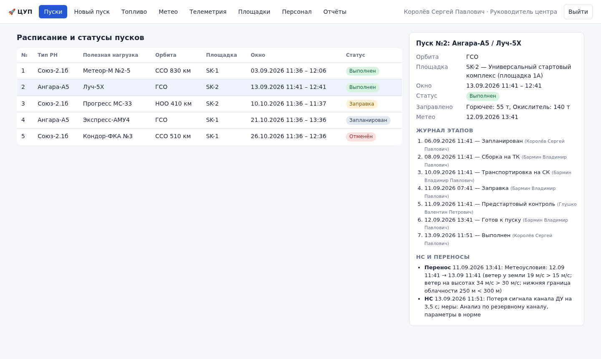
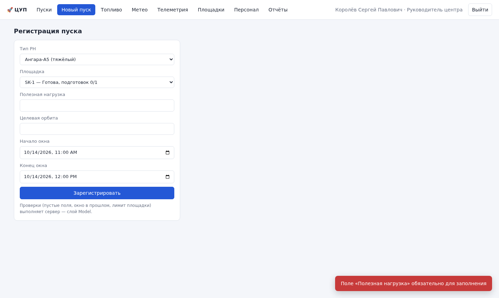
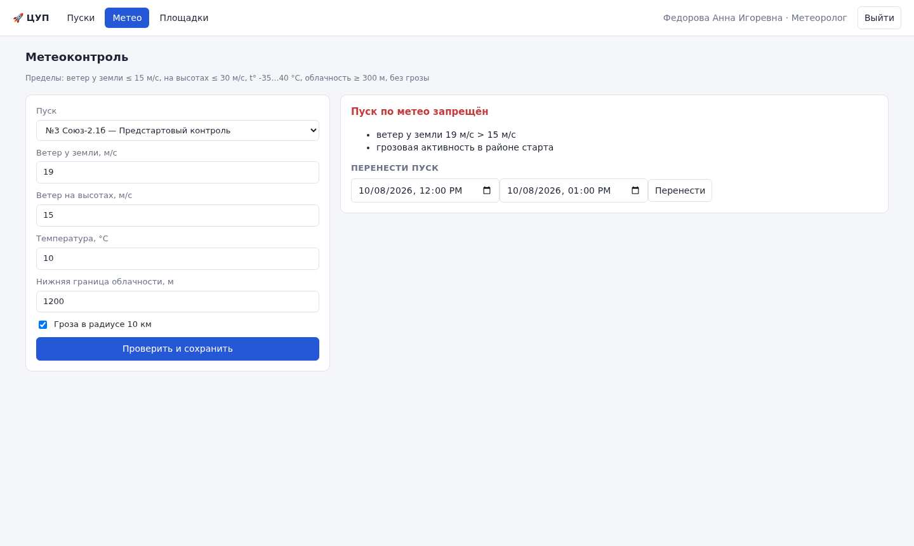

# АИС «Центр управления космическими пусками»

Учетная система наземной инфраструктуры космодрома. В ней регистрируют пуски ракет-носителей,
ведут подготовку по этапам, учитывают топливо по партиям, следят за загрузкой и обслуживанием
стартовых площадок, вводят метеоданные и нештатные ситуации и строят отчеты для руководителя.

Лабораторная работа №3 «Прямое проектирование: от описания к моделям и коду», вариант 3.
Журнал решений, принятых по ходу работы, находится в конце файла.

## Запуск

Нужен Python 3.10 или новее. Сторонние библиотеки и интернет не нужны: база данных встроенная (SQLite),
Vue 3 лежит в репозитории.

Windows: двойной клик по `start.bat`. Linux и macOS: `./start.sh`.

Скрипт при первом запуске создает демо-базу `demo.db`, запускает сервер и открывает в браузере
http://127.0.0.1:8000. Чтобы остановить сервер, закройте окно с ним.

То же из командной строки:

```bash
python -m lcc                          # демо-база demo.db, сервер и браузер
python -m lcc --db work.db --init      # пустая рабочая база: сначала создается учетная запись руководителя
python -m lcc --port 8080 --no-browser # другой порт, браузер не открывать
python -m unittest discover -s tests   # тесты
```

| Логин | Роль | Что посмотреть |
|---|---|---|
| `head` | руководитель центра | регистрация, перенос и отмена пуска, результат пуска, отчеты, персонал |
| `engineer` | инженер ТК | этапы сборки, транспортировки и предстартового контроля, ТО площадок |
| `fuel` | инженер по заправке | прием партий, заправка пуска №3 и закрытие этапа заправки |
| `meteo` | метеоролог | ввод метеоданных; при шторме система запрещает пуск и предлагает перенос |
| `telemetry` | оператор телеметрии | каналы телеметрии, регистрация нештатных ситуаций |

Пароль у всех демо-пользователей `demo2026`. Для рабочей базы такой пароль не годится, ее создают через `--init`.



| Ошибка проверки в Model | Метеоконтроль запретил пуск |
|---|---|
|  |  |

## 1. Предметная область

Центр управления готовит и проводит пуски ракет-носителей (РН). Пуск регистрируют с типом
носителя, полезной нагрузкой, целевой орбитой и стартовым окном. Подготовка идет по этапам: сборка
ракеты на техническом комплексе (ТК), транспортировка на стартовый комплекс (СК), заправка и
предстартовый контроль. Горючее и окислитель учитываются по партиям со сроком годности, расход
записывается на каждый пуск.

У стартовой площадки есть предел одновременных подготовок. После определенного числа пусков или
моточасов ее нужно обслуживать. Телеметрия идет по каналам, закрепленным за системами носителя,
и потеря сигнала считается нештатной ситуацией (НС). Если погода выходит за допустимые пределы,
пуск переносят и записывают причину.

## 2. Исходные требования

### 2.1. Сущности

| Группа | Сущность | Что хранится |
|---|---|---|
| Люди | сотрудник | ФИО, роль, логин, хеш и соль пароля |
| Объекты | тип РН | наименование, класс (легкий, средний, тяжелый), число ступеней |
| | стартовая площадка | код, наименование, предел одновременных подготовок, нормативы циклов и моточасов до ТО, признак неисправности |
| | партия топлива | номер, компонент, марка, объем, дата изготовления, срок годности |
| | канал телеметрии | номер, система РН, параметр, частота опроса |
| События | пуск | тип РН, полезная нагрузка, орбита, площадка, стартовое окно, статус |
| | журнал этапов | смена статуса пуска: время и сотрудник |
| | расход топлива | пуск, партия, объем, время |
| | обслуживание площадки | вид работ, время начала и окончания |
| | метеонаблюдение | ветер у земли и на высотах, температура, облачность, гроза |
| | нештатная ситуация | пуск, канал, время, описание, принятые меры |
| Документы | перенос пуска | причина, старое и новое окно, комментарий |

Отчеты в базе не хранятся, они собираются из этих данных при запросе.

### 2.2. Процессы

1. Регистрация пуска с проверкой окна и площадки.
2. Подготовка по этапам: сборка на ТК, транспортировка на СК, заправка, предстартовый контроль.
3. Учет топлива: прием партий, контроль срока годности, списание при заправке.
4. Обслуживание площадок: счет циклов и моточасов, начало и закрытие ТО.
5. Метеоконтроль: ввод наблюдения, сравнение с пределами, допуск или перенос.
6. Пуск и телеметрический контроль: результат пуска, регистрация НС.
7. Отчеты для руководителя.

### 2.3. Роли и права

| Действие | Руководитель | Инженер ТК | Инженер по заправке | Метеоролог | Оператор ТМ |
|---|:-:|:-:|:-:|:-:|:-:|
| Регистрация и отмена пуска | ✔ | | | | |
| Просмотр расписания | ✔ | ✔ | ✔ | ✔ | ✔ |
| Этапы сборки, транспортировки, предстартового контроля | ✔ | ✔ | | | |
| Прием партий, заправка, закрытие этапа заправки | ✔ | | ✔ | | |
| ТО и неисправность площадок | ✔ | ✔ | | | |
| Новые площадки и типы РН | ✔ | | | | |
| Метеоданные | ✔ | | | ✔ | |
| Перенос пуска | ✔ (любая причина) | | | ✔ (только по метео) | |
| Каналы телеметрии и НС | ✔ | | | | ✔ |
| Результат пуска, отчеты, персонал | ✔ | | | | |

Записи о расходе, НС и переносах никто не удаляет, их можно только добавлять.

### 2.4. Правила

```
Запланирован → Сборка на ТК → Транспортировка на СК → Заправка → Предстартовый контроль → Готов к пуску → Выполнен / Авария
Пуск можно отменить в любом статусе, пока он не завершен. Перенос сдвигает окно, статус остается прежним.
```

* Этапы проходятся строго по порядку.
* Обязательные поля пуска: тип РН, полезная нагрузка, орбита, площадка, начало и конец окна.
  Начало окна раньше конца, длительность от 1 минуты до 24 часов, при регистрации окно не в прошлом.
* На площадке одновременно идет не больше подготовок, чем разрешено. Неисправную площадку и площадку
  на обслуживании занять нельзя. Когда счетчик циклов или моточасов доходит до норматива, площадка
  получает состояние «Требует ТО» и остается закрытой, пока ТО не проведут.
* Топливо списывается из партии нужного компонента, если срок годности не вышел и хватает остатка.
  Этап заправки закрывается, только когда залиты и горючее, и окислитель.
* Допуск к пуску дает метеонаблюдение не старше 3 часов. Пределы: ветер у земли до 15 м/с, на высотах
  до 30 м/с, температура от −35 до +40 °C, нижняя граница облачности от 300 м, грозы нет.
* Результат пуска записывается из статуса «Готов к пуску» и только внутри стартового окна.
* Все эти проверки выполняет слой Model на сервере. Интерфейс их не дублирует.

### 2.5. Отчеты

| Отчет | Содержание |
|---|---|
| Пуски по типам носителей | пуски за период по типам РН: выполнено, авария, отменено, в подготовке, число переносов |
| Расход топлива по партиям | объем, расход за период, остаток, процент использования, срок годности |
| Загрузка стартовых площадок | подготовки и пуски за период, занятость в сутках, процент загрузки, остаток до ТО |
| НС и переносы | НС по системам РН, переносы по причинам |

Период задается датами «с» и «по». Любой отчет можно скачать в CSV.

## 3. Модели

| № | Модель | Документ |
|---|---|---|
| 1 | IDEF0: контекстная диаграмма, декомпозиции A0 и A2 | [docs/01_idef0.md](docs/01_idef0.md) |
| 2 | UseCase и диаграммы последовательности | [docs/02_usecase_sequence.md](docs/02_usecase_sequence.md) |
| 3 | DFD: контекст и первый уровень | [docs/03_dfd.md](docs/03_dfd.md) |
| 4 | IDEF1X, модель данных | [docs/04_idef1x.md](docs/04_idef1x.md) |
| 5 | Архитектура MVC, диаграммы классов и состояний | [docs/05_architecture.md](docs/05_architecture.md) |
| 6 | Аудит собственного кода | [docs/06_audit.md](docs/06_audit.md) |
| | Документация кода (pdoc) | [docs/api/index.html](docs/api/index.html), пересобирается командой `tools/gen_docs.sh` |

## 4. Архитектура MVC

```
lcc/
├── model/              Model: данные и вся бизнес-логика
│   ├── enums.py           статусы, роли, матрица прав ROLE_PERMISSIONS
│   ├── validation.py      проверка полей
│   ├── entities.py        Staff, VehicleType, LaunchPad, Launch, LaunchWindow, FuelBatch, TelemetryChannel
│   ├── stages.py          этапы подготовки A21–A24, у каждого свое условие завершения
│   ├── weather.py         метеонаблюдение и предельные значения
│   ├── journal.py         Incident и Postponement с общим предком JournalRecord
│   ├── security.py        хеширование паролей PBKDF2, Session.require(permission)
│   ├── schema.sql         схема SQLite по модели IDEF1X
│   ├── database.py        соединение и транзакции
│   ├── repositories.py    доступ к таблицам, только параметризованные запросы
│   ├── services.py        сценарии: регистрация, этапы, заправка, метео, НС, ТО, персонал
│   └── reports.py         четыре отчета с общим предком Report
├── controller/
│   └── web.py           Controller: JSON API (WebApi) и встроенный http.server
├── view/               View
│   ├── web/               index.html, app.js, style.css; Vue 3 в vendor/
│   └── csv_export.py      CSV-файл отчета
├── seed.py             демо-данные
└── __main__.py         точка входа
tests/                  модель, сервисы, API и сквозной сценарий всеми ролями
```

Страница на Vue отправляет запрос в JSON API. `WebApi` разбирает его, по токену находит сессию
пользователя и вызывает нужный сервис Model. Сервис проверяет права и правила, работает с
сущностями и репозиториями и возвращает результат или исключение `DomainError`. Контроллер
превращает результат в JSON, а исключение в ответ с кодом 400, 401, 403 или 404 и текстом ошибки,
который страница показывает пользователю. Model не импортирует ни контроллер, ни представление,
а страница не обращается к базе напрямую.

Вкладки на странице зависят от роли, но это только удобство. Права сервер проверяет при каждом
запросе, поэтому запрос в обход интерфейса получает отказ 403.

| № | Сценарий | Роль | Что проверяет Model |
|---|---|---|---|
| S1 | Вход | все | хеш пароля, блокировка на 15 минут после 5 ошибок |
| S2 | Регистрация пуска | руководитель | обязательные поля, окно, состояние и загрузка площадки |
| S3 | Подготовка и заправка | инженер ТК, инженер по заправке | порядок этапов, срок годности и остаток партии, оба компонента |
| S4 | Метеоконтроль и перенос | метеоролог | пределы, возраст наблюдения, новое окно позже старого |
| S5 | НС и результат пуска | оператор ТМ, руководитель | статус «Готов к пуску», время внутри окна, учет цикла площадки |
| S6 | Отчеты и CSV | руководитель | корректный период, защита CSV от формул |

## Журнал решений

| № | Решение | Причина |
|---|---|---|
| 1 | Вариант 3, «Центр управления космическими пусками» | выбор группы |
| 2 | Роли по участкам работ ЦУП плюс руководитель | так устроены процессы в описании предметной области |
| 3 | Отчеты не хранятся, а вычисляются | нет лишних данных, которые могут разойтись с исходными |
| 4 | IDEF0 рисуется своим генератором на бланке по Р 50.1.028-2001, Mermaid и PlantUML как дополнение | GitHub не показывает бланк IDEF0, а генератор дает одинаковый результат при каждой сборке |
| 5 | A0 разбит на 5 блоков, A2 на 4 этапа подготовки | этапы A21–A24 стали статусами пуска в коде |
| 6 | Права и бизнес-правила проверяются в Model | на занятии №2 проверку только в интерфейсе удавалось обойти |
| 7 | Остаток топлива, счетчики площадки и ее состояние вычисляются | хранимые счетчики легко рассинхронизировать с журналом |
| 8 | Перенос записывается событием, статус пуска не меняется | заправленную ракету не нужно собирать заново из-за погоды |
| 9 | Python и SQLite без внешних зависимостей | программа запускается на компьютерах колледжа без установки пакетов |
| 10 | Этапы подготовки и отчеты сделаны иерархиями классов с реестрами `STAGES` и `REPORTS` | новый этап или отчет добавляется отдельным классом, без правки условий |
| 11 | Сначала был консольный интерфейс, затем его заменил веб-интерфейс на Vue 3 | в браузере систему проще показывать; при замене Model не менялась |
| 12 | Vue подключен без сборки, сервер на встроенном `http.server` | не нужны Node.js и npm |
