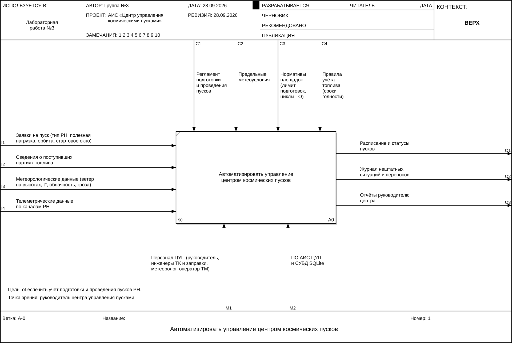
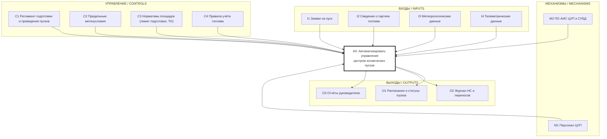
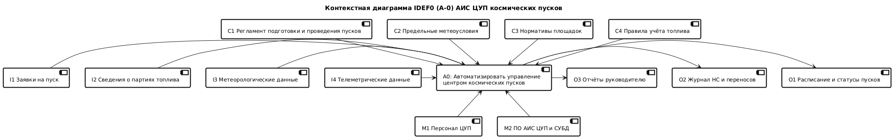
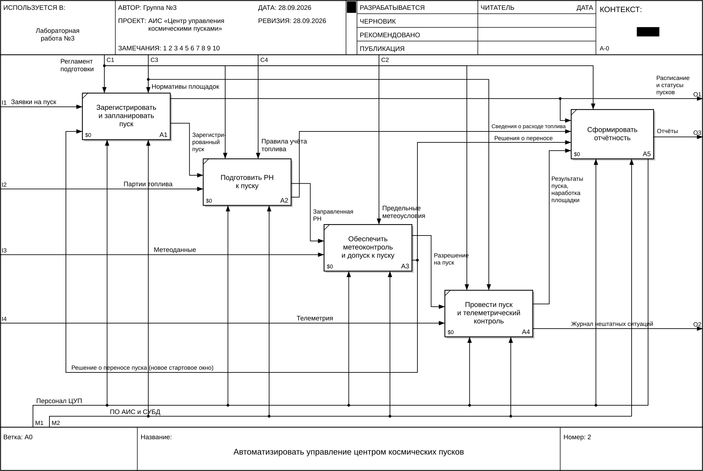
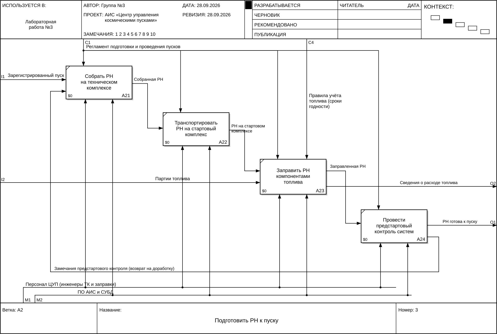

# 1. Функциональная модель IDEF0

Нотация — Р 50.1.028-2001 / РД IDEF0-2000. Диаграммы оформлены на бланке IDEF0
(шапка «Автор / Проект / Статус / Контекст», подвал «Ветка / Название / Номер»).
Исходник генератора: [`diagrams/idef0/idef0.py`](diagrams/idef0/idef0.py).

* **Цель моделирования:** обеспечить учёт подготовки и проведения пусков ракет-носителей.
* **Точка зрения:** руководитель центра управления пусками.

## 1.1. Контекстная диаграмма A-0

### Спецификация стрелок (ICOM)

| Код | Стрелка | Описание |
|---|---|---|
| **I1** | Заявки на пуск | тип РН, полезная нагрузка, целевая орбита, стартовое окно, площадка |
| **I2** | Сведения о поступивших партиях топлива | номер партии, компонент (горючее/окислитель), марка, объём, срок годности |
| **I3** | Метеорологические данные | ветер у земли и на высотах, температура, облачность, грозовая активность |
| **I4** | Телеметрические данные по каналам РН | параметры систем носителя, признак потери сигнала |
| **C1** | Регламент подготовки и проведения пусков | порядок этапов, статусная модель пуска, права ролей |
| **C2** | Предельные метеоусловия | пороги ветра, температуры, облачности, запрет при грозе |
| **C3** | Нормативы площадок | лимит одновременных подготовок, нормативы циклов и моточасов до ТО |
| **C4** | Правила учёта топлива | запрет использования просроченных партий, списание не более остатка |
| **M1** | Персонал ЦУП | руководитель, инженер ТК, инженер по заправке, метеоролог, оператор телеметрии |
| **M2** | ПО АИС ЦУП и СУБД | веб-приложение (Python, Vue) и база данных SQLite |
| **O1** | Расписание и статусы пусков | актуальный список пусков с текущими статусами |
| **O2** | Журнал нештатных ситуаций и переносов | зафиксированные НС (потери сигнала) и переносы с причинами |
| **O3** | Отчёты руководителю центра | пуски по типам РН, расход топлива по партиям, загрузка площадок, НС и переносы |

### Код контекстной диаграммы на Mermaid

### Код контекстной диаграммы на PlantUML

Файл: [`diagrams/idef0/A-0_plantuml.puml`](diagrams/idef0/A-0_plantuml.puml)

## 1.2. Декомпозиция A0

| Блок | Функция | Входы | Управление | Выходы |
|---|---|---|---|---|
| A1 | Зарегистрировать и запланировать пуск | I1, решение о переносе (от A3) | C1, C3 | зарегистрированный пуск → A2; O1 расписание (→ A5) |
| A2 | Подготовить РН к пуску | зарегистрированный пуск, I2 | C1, C4 | заправленная РН → A3; сведения о расходе топлива → A5 |
| A3 | Обеспечить метеоконтроль и допуск к пуску | заправленная РН, I3 | C2 | разрешение на пуск → A4; решение о переносе → A1, A5 |
| A4 | Провести пуск и телеметрический контроль | разрешение на пуск, I4 | C1, C3 | результаты пуска и наработка площадки → A5; O2 журнал НС |
| A5 | Сформировать отчётность | расписание, расход топлива, переносы, результаты | C1 | O3 отчёты |

Механизмы M1 (персонал) и M2 (ПО и СУБД) поддерживают все блоки.

**Обратная связь:** решение о переносе пуска из A3 возвращается на вход A1: пуск получает
новое стартовое окно и снова проходит планирование (проверку загрузки площадки).

## 1.3. Декомпозиция A2 «Подготовить РН к пуску»

| Блок | Функция | Вход | Управление | Выход |
|---|---|---|---|---|
| A21 | Собрать РН на техническом комплексе | зарегистрированный пуск (I1), замечания контроля | C1 | собранная РН |
| A22 | Транспортировать РН на стартовый комплекс | собранная РН | C1 | РН на стартовом комплексе |
| A23 | Заправить РН компонентами топлива | РН на СК, партии топлива (I2) | C1, C4 | заправленная РН; сведения о расходе топлива (O2) |
| A24 | Провести предстартовый контроль систем | заправленная РН | C1 | РН готова к пуску (O1); замечания → A21 |

Именно эта последовательность реализована в коде как строгая статусная модель пуска
(см. `LaunchStatus` и `Launch.advance()`).
