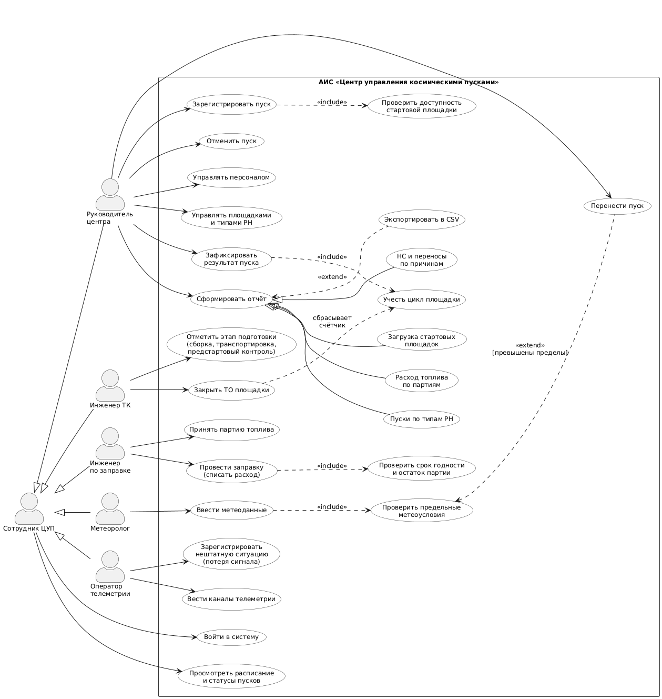
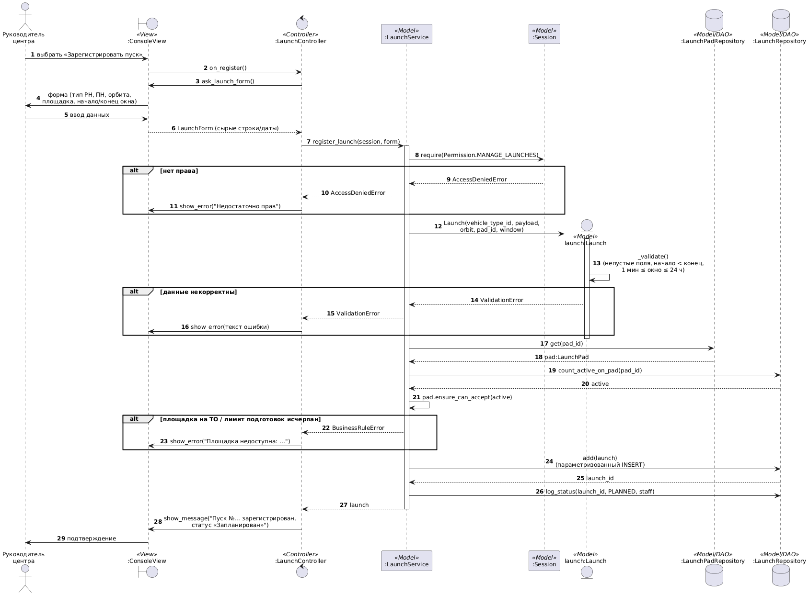
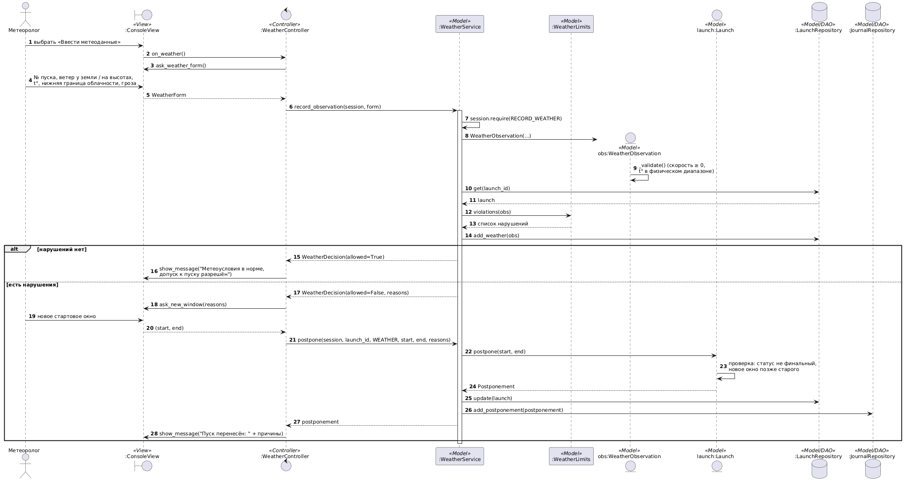
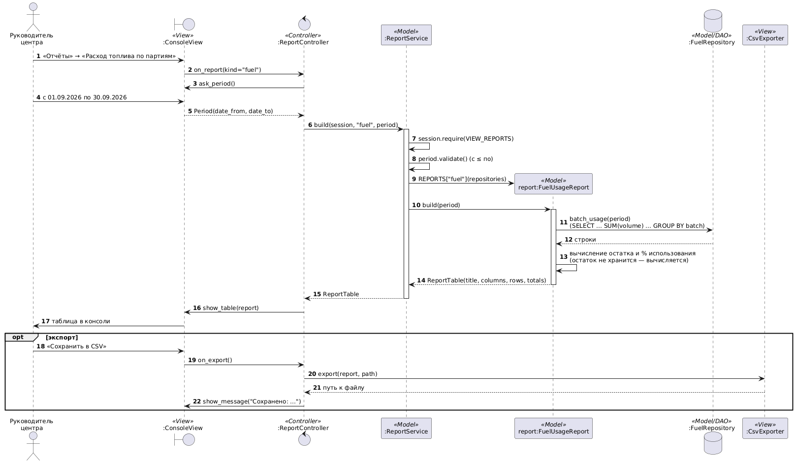

# 2. UseCase-диаграмма и диаграммы последовательности (UML 2.5.1)

## 2.1. UseCase-диаграмма

Исходник: [`diagrams/uml/usecase.puml`](diagrams/uml/usecase.puml)

**Акторы.** Все роли — специализации абстрактного актора «Сотрудник ЦУП», которому
доступны вход в систему и просмотр расписания пусков.

| Актор | Прецеденты |
|---|---|
| Руководитель центра | регистрация и отмена пуска, управление персоналом, площадками и типами РН, фиксация результата пуска, перенос пуска, формирование отчётов |
| Инженер ТК | отметка этапов «Сборка на ТК», «Транспортировка на СК», «Предстартовый контроль»; закрытие ТО площадки |
| Инженер по заправке | приём партий топлива, заправка РН (списание расхода) |
| Метеоролог | ввод метеоданных (с автоматической проверкой предельных условий) |
| Оператор телеметрии | ведение каналов телеметрии, регистрация нештатных ситуаций |

**Отношения:**
* `<<include>>`: регистрация пуска всегда включает проверку доступности площадки,
  заправка — проверку срока годности и остатка партии, ввод метеоданных — проверку
  предельных условий, фиксация результата — учёт цикла площадки;
* `<<extend>>`: перенос пуска расширяет проверку метеоусловий при условии
  `[превышены пределы]`; экспорт в CSV расширяет формирование отчёта;
* обобщение: четыре конкретных отчёта — специализации прецедента «Сформировать отчёт».

## 2.2. Диаграммы последовательности

Выбраны три ключевых сценария, проходящих через все слои MVC. Стереотипы
`<<View>>`, `<<Controller>>`, `<<Model>>`, `<<Model/DAO>>` показывают принадлежность объекта слою.

### S2. Регистрация пуска

[`diagrams/uml/seq_register_launch.puml`](diagrams/uml/seq_register_launch.puml)

Проверки выполняются **в Model**: права доступа (`Session.require`), корректность
полей и стартового окна (`Launch._validate`), доступность площадки
(`LaunchPad.ensure_can_accept`). Controller лишь переводит исключения в сообщения View.

### S4. Метеоконтроль и перенос пуска

[`diagrams/uml/seq_weather_check.puml`](diagrams/uml/seq_weather_check.puml)

Предельные значения задаются объектом `WeatherLimits` (управляющая стрелка C2 на IDEF0).
При нарушении — фрагмент `alt [есть нарушения]`: пользователь вводит новое окно,
`Launch.postpone()` проверяет, что статус не финальный и окно сдвигается вперёд,
в журнал пишется `Postponement` с причиной «метео».

### S6. Формирование отчёта

[`diagrams/uml/seq_report.puml`](diagrams/uml/seq_report.puml)

`ReportService` выбирает конкретный отчёт из реестра (полиморфизм: все отчёты
реализуют `Report.build(period)`). Остаток партии не хранится в БД, а вычисляется как
`начальный объём − Σ расходов`.
