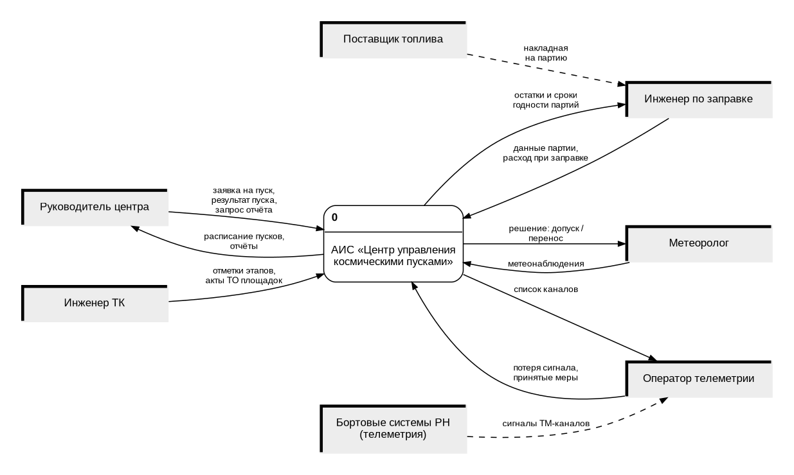
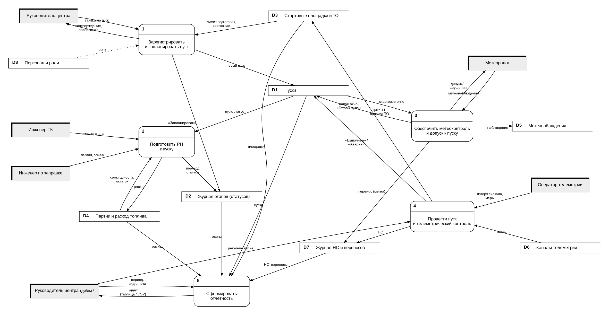
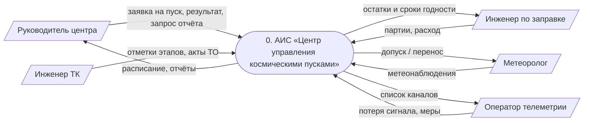

# 3. Диаграммы потоков данных (DFD)

Нотация Гейна–Сарсона. Генератор: [`diagrams/dfd/dfd.py`](diagrams/dfd/dfd.py) (Graphviz).

| Элемент | Обозначение |
|---|---|
| Внешняя сущность | серый прямоугольник с утолщёнными левой и верхней гранями; дубль помечен «/» |
| Процесс | скруглённый прямоугольник, сверху — номер процесса |
| Хранилище данных | прямоугольник, открытый справа, с идентификатором `Dn` |
| Поток данных | стрелка с подписью; пунктир — поток вне границ системы |

## 3.1. Контекстная диаграмма (уровень 0)

Поставщик топлива и бортовые системы РН не взаимодействуют с АИС напрямую: данные
вносят инженер по заправке и оператор телеметрии (пунктирные потоки).

## 3.2. Диаграмма уровня 1

Процессы 1–5 соответствуют блокам A1–A5 IDEF0, хранилища D1–D8 — таблицам модели
данных IDEF1X:

| Хранилище | Таблицы (IDEF1X) |
|---|---|
| D1 Пуски | `LAUNCH`, `VEHICLE_TYPE` |
| D2 Журнал этапов | `STAGE_LOG` |
| D3 Стартовые площадки и ТО | `LAUNCH_PAD`, `PAD_MAINTENANCE` |
| D4 Партии и расход топлива | `FUEL_BATCH`, `FUEL_CONSUMPTION` |
| D5 Метеонаблюдения | `WEATHER_OBSERVATION` |
| D6 Каналы телеметрии | `TELEMETRY_CHANNEL` |
| D7 Журнал НС и переносов | `INCIDENT`, `POSTPONEMENT` |
| D8 Персонал и роли | `STAFF` |

Процесс 5 только читает хранилища: отчёты не сохраняются, а вычисляются.

## 3.3. Контекстная DFD на Mermaid (упрощённо)

