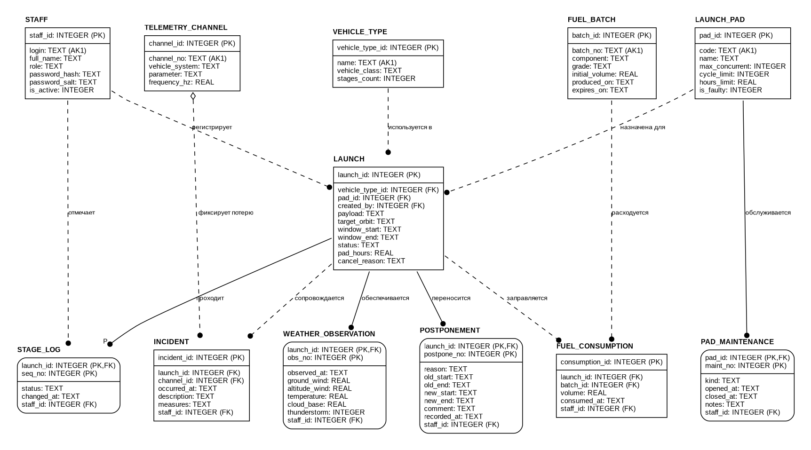
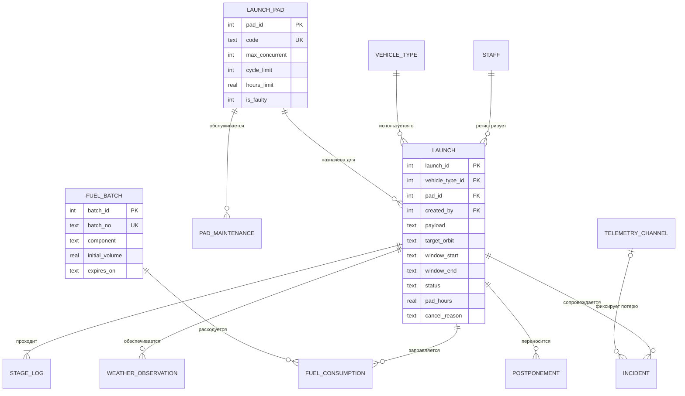

# 4. Модель данных IDEF1X

Уровень ключей и атрибутов (FA). Генератор: [`diagrams/idef1x/idef1x.py`](diagrams/idef1x/idef1x.py).
Физическая схема SQLite — [`lcc/model/schema.sql`](../lcc/model/schema.sql).

**Обозначения:** прямые углы — независимая сущность, скруглённые — зависимая;
над чертой — первичный ключ; сплошная линия — идентифицирующая связь, пунктир —
неидентифицирующая; точка — сторона потомка («многие»), `P` — один или более,
ромб — необязательная связь (FK допускает NULL). `AK1` — альтернативный (уникальный) ключ.

## 4.1. Сущности

| Сущность | Тип | Первичный ключ | Назначение |
|---|---|---|---|
| STAFF | независимая | staff_id | сотрудник, роль, хеш и соль пароля |
| VEHICLE_TYPE | независимая | vehicle_type_id | тип ракеты-носителя |
| LAUNCH_PAD | независимая | pad_id | стартовая площадка и её нормативы |
| FUEL_BATCH | независимая | batch_id | партия компонента топлива |
| TELEMETRY_CHANNEL | независимая | channel_id | канал телеметрии, закреплённый за системой РН |
| LAUNCH | независимая | launch_id | пуск (FK на тип РН, площадку, автора — неидентифицирующие) |
| STAGE_LOG | зависимая от LAUNCH | launch_id, seq_no | журнал переходов статусов пуска |
| WEATHER_OBSERVATION | зависимая от LAUNCH | launch_id, obs_no | метеонаблюдение для пуска |
| POSTPONEMENT | зависимая от LAUNCH | launch_id, postpone_no | перенос пуска с причиной |
| PAD_MAINTENANCE | зависимая от LAUNCH_PAD | pad_id, maint_no | межпусковое обслуживание |
| FUEL_CONSUMPTION | независимая | consumption_id | расход партии на пуск (связь M:N LAUNCH–FUEL_BATCH) |
| INCIDENT | независимая | incident_id | нештатная ситуация (канал — необязателен) |

## 4.2. Связи

| Родитель | Потомок | Вид | Мощность | Фраза |
|---|---|---|---|---|
| VEHICLE_TYPE | LAUNCH | неидентиф. | 1 : 0..N | тип РН *используется в* пусках |
| LAUNCH_PAD | LAUNCH | неидентиф. | 1 : 0..N | площадка *назначена для* пусков (одновременно — не более `max_concurrent` активных) |
| STAFF | LAUNCH | неидентиф. | 1 : 0..N | сотрудник *регистрирует* пуск |
| LAUNCH | STAGE_LOG | идентиф. | 1 : P (1..N) | пуск *проходит* этапы (минимум запись «Запланирован») |
| LAUNCH_PAD | PAD_MAINTENANCE | идентиф. | 1 : 0..N | площадка *обслуживается* |
| LAUNCH / FUEL_BATCH | FUEL_CONSUMPTION | неидентиф. | 1 : 0..N | пуск *заправляется* из партии, партия *расходуется* |
| LAUNCH | WEATHER_OBSERVATION | идентиф. | 1 : 0..N | пуск *обеспечивается* наблюдениями |
| LAUNCH | POSTPONEMENT | идентиф. | 1 : 0..N | пуск *переносится* |
| LAUNCH | INCIDENT | неидентиф. | 1 : 0..N | пуск *сопровождается* НС |
| TELEMETRY_CHANNEL | INCIDENT | неидентиф., необяз. | 0..1 : 0..N | канал *фиксирует потерю* сигнала |

Атрибут `staff_id` журнальных сущностей — FK на STAFF (на диаграмме показаны не все
связи с STAFF, чтобы не перегружать её).

## 4.3. Устранение избыточности (вычисляемые показатели)

По требованию методички в БД **не хранится** ничего, что можно вычислить:

| Показатель | Как вычисляется |
|---|---|
| Остаток партии топлива | `initial_volume − Σ FUEL_CONSUMPTION.volume` |
| Циклы площадки с последнего ТО | число пусков в статусах «Выполнен»/«Авария» на площадке после `closed_at` последнего ТО |
| Моточасы площадки с последнего ТО | `Σ LAUNCH.pad_hours` тех же пусков |
| Состояние площадки | `is_faulty` → «Неисправна»; открытое ТО → «На обслуживании»; циклы ≥ лимита или часы ≥ лимита → «Требует ТО»; иначе «Готова» |
| Число активных подготовок на площадке | `COUNT(LAUNCH)` в статусах от «Сборка на ТК» до «Готов к пуску» |
| Длительность подготовки / занятость площадки | разность дат первой записи «Сборка на ТК» и финальной записи в STAGE_LOG |
| Допуск по метео | вычисляется по `WeatherLimits` в момент ввода наблюдения |

Схема находится в 3НФ: неключевые атрибуты зависят только от полного ключа,
транзитивных зависимостей нет (например, класс РН хранится в VEHICLE_TYPE, а не в LAUNCH).

## 4.4. ER-диаграмма на Mermaid

