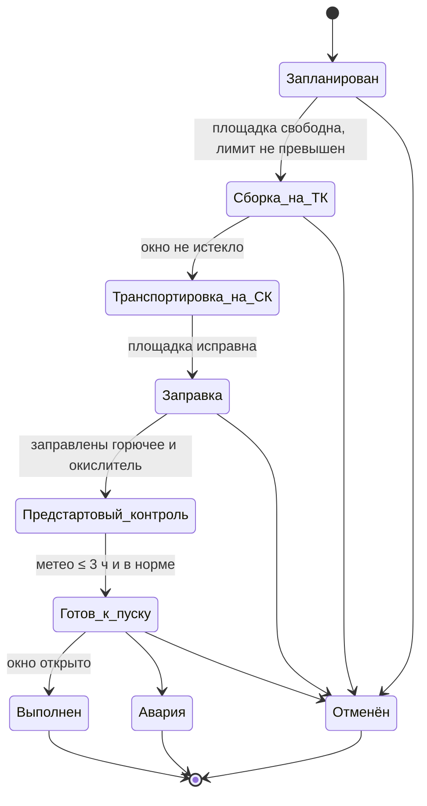

# 5. Архитектура MVC и диаграммы классов

## 5.1. Разделение на слои

Исходник: [`diagrams/uml/class_mvc.puml`](diagrams/uml/class_mvc.puml)

| Слой | Пакет | Ответственность | Что запрещено |
|---|---|---|---|
| **Model** | `lcc.model` | сущности, валидация полей, статусная модель, бизнес-правила (лимит площадки, сроки годности топлива, метеопределы), проверка прав, хранение (SQLite), отчёты | импорт View/Controller, ввод-вывод в консоль |
| **View** | `lcc.view` | меню, формы ввода (разбор формата чисел и дат), таблицы, сообщения об ошибках, экспорт CSV | бизнес-правила, обращение к БД и сервисам |
| **Controller** | `lcc.controller` | принять действие из View → вызвать сервис Model → передать результат/ошибку во View; меню по правам роли | собственные проверки бизнес-правил, SQL |

Зависимости направлены только **Controller → Model** и **Controller → View**.
View ничего не знает о Model: Controller передаёт ему готовые строки таблиц.

## 5.2. Интерфейсы взаимодействия слоёв

| Интерфейс | Где определён | Кто использует | Назначение |
|---|---|---|---|
| `View` (ABC) | `lcc/view/base.py` | все контроллеры | `show_*`, `ask_*`, `choose`, `confirm`; реализации: `ConsoleView`, тестовый `ScriptedView` |
| `Services` (фасад) | `lcc/model/services.py` | все контроллеры | единая точка входа в сценарии Model (`auth`, `launches`, `fuel`, `weather`, `telemetry`, `pads`, `reference`, `staff`, `reports`) |
| `Session` | `lcc/model/security.py` | сервисы Model | передаётся в каждый метод сервиса; `require(Permission)` проверяет права |
| `DomainError` и наследники | `lcc/model/errors.py` | `BaseController.safe()` | Model сообщает об ошибке исключением; Controller не подавляет её, а показывает текст через `View.show_error` |
| DTO `ReportTable`, `LaunchCard`, `PadUsage`, `WeatherDecision` | Model | Controller → View | данные для отображения без доступа View к хранилищу |

## 5.3. Классы предметной области

Исходник: [`diagrams/uml/class_domain.puml`](diagrams/uml/class_domain.puml)

**Наследование (осмысленное, глубина ≤ 2):**
* `Entity` → `Staff`, `VehicleType`, `LaunchPad`, `Launch`, `FuelBatch`, `TelemetryChannel` — общий суррогатный id;
* `JournalRecord` (абстрактный) → `Incident`, `Postponement` — единый журнал пуска, полиморфный `summary()`;
* `PreparationStage` (абстрактный) → `PlanningStage`, `AssemblyStage`, `TransportStage`, `FuelingStage`,
  `PrelaunchCheckStage` — у каждого этапа своё условие завершения `check_completion()`
  (вместо цепочки `if status == …`);
* `Report` (абстрактный) → 4 отчёта с общим `build(period)`; выбор по реестру `REPORTS`;
* `View` (интерфейс) → `ConsoleView`; `BaseController` → 7 контроллеров.

**Композиция:** `Launch` ◆— `LaunchWindow`; `Postponement` ◆— 2 × `LaunchWindow`;
`AppController` ◆— `MenuItem`; фасад `Services` ◆— сервисы.

**Ассоциации:** `Launch` → `VehicleType`, `LaunchPad`, `Staff`; `FuelConsumption` связывает `Launch` и `FuelBatch`
(M:N); `Incident` → `TelemetryChannel` (0..1).

**Инкапсуляция:** все поля сущностей закрыты (`_name`), доступ — через свойства только для чтения,
изменение — через методы с проверкой инвариантов (`advance()`, `postpone()`, `cancel()`, `complete()`).

## 5.4. Статусная модель пуска

Исходник: [`diagrams/uml/launch_state.puml`](diagrams/uml/launch_state.puml). То же на Mermaid:

Перенос не меняет статус: сдвигается стартовое окно, в журнал пишется `Postponement`.
