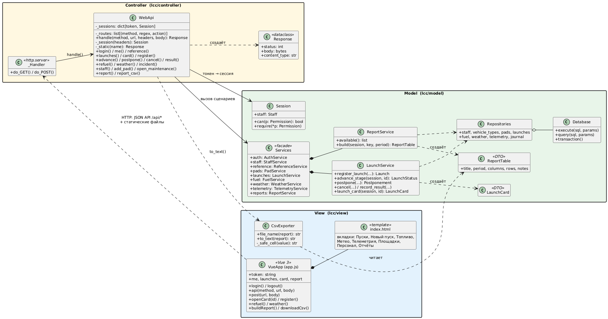
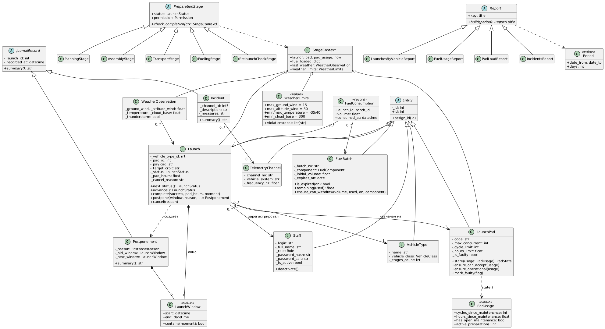
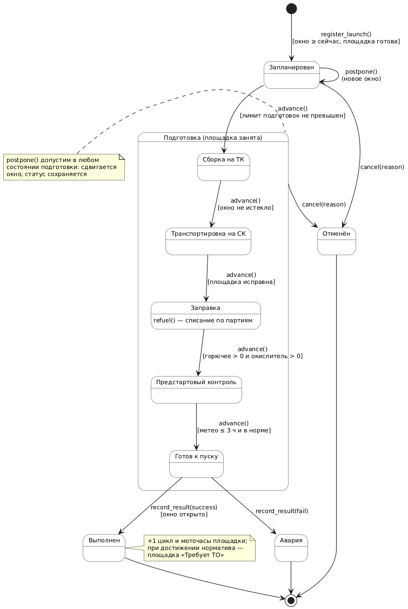
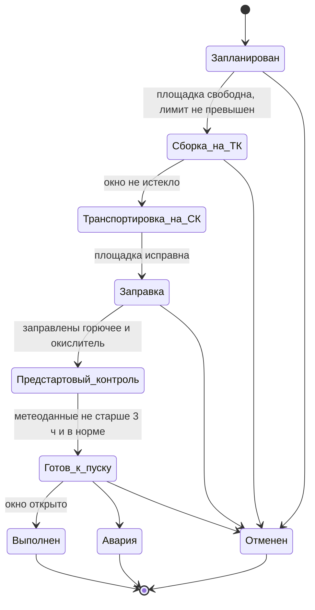

# 5. Архитектура MVC и диаграммы классов

## 5.1. Разделение на слои

Исходник: [`diagrams/uml/class_mvc.puml`](diagrams/uml/class_mvc.puml)

| Слой | Где лежит | За что отвечает | Чего в нем нет |
|---|---|---|---|
| Model | `lcc/model` | сущности, проверка полей, статусы пуска, бизнес-правила, проверка прав, хранение в SQLite, отчеты | импорта View и Controller, работы с HTTP и HTML |
| View | `lcc/view/web`, `lcc/view/csv_export.py` | страница на Vue: вкладки, формы, таблицы, сообщения об ошибках; файл CSV | бизнес-правил, обращений к базе |
| Controller | `lcc/controller/web.py` | принимает HTTP-запрос, разбирает JSON и даты, вызывает сервис Model, возвращает JSON или ошибку | проверок бизнес-правил и SQL |

Controller зависит от Model, View общается с Controller только через HTTP. Model не знает,
каким интерфейсом ее показывают. Это проверено на практике: сначала в проекте был консольный
интерфейс, потом его заменили страницей на Vue, а в Model при этом не поменялась ни одна строка.

## 5.2. Как слои взаимодействуют

| Интерфейс | Где определен | Кто пользуется | Назначение |
|---|---|---|---|
| JSON API `/api/*` | `lcc/controller/web.py`, класс `WebApi` | страница на Vue (`app.js`) | вход по логину и паролю, затем запросы с токеном в заголовке `Authorization` |
| фасад `Services` | `lcc/model/services.py` | `WebApi` | одна точка входа во все сценарии: `auth`, `launches`, `fuel`, `weather`, `telemetry`, `pads`, `reference`, `staff`, `reports` |
| `Session` | `lcc/model/security.py` | сервисы Model | передается в каждый метод сервиса, `require(Permission)` проверяет права |
| `DomainError` и наследники | `lcc/model/errors.py` | `WebApi.handle()` | Model сообщает об ошибке исключением, контроллер отвечает кодом 400, 401, 403 или 404 с текстом ошибки |
| DTO `ReportTable`, `LaunchCard`, `PadUsage`, `WeatherDecision` | Model | `WebApi` | данные для показа, которые контроллер переводит в JSON |

`WebApi.handle(method, url, headers, body)` не зависит от сетевого сервера. Тесты вызывают его
напрямую и проходят весь сценарий без запуска браузера.

## 5.3. Классы предметной области

Исходник: [`diagrams/uml/class_domain.puml`](diagrams/uml/class_domain.puml)

Наследование используется там, где у классов есть общее поведение, глубина не больше двух уровней:

* `Entity` → `Staff`, `VehicleType`, `LaunchPad`, `Launch`, `FuelBatch`, `TelemetryChannel` (общий идентификатор);
* `JournalRecord` → `Incident`, `Postponement` (общий журнал пуска, у каждой записи свой `summary()`);
* `PreparationStage` → `PlanningStage`, `AssemblyStage`, `TransportStage`, `FuelingStage`, `PrelaunchCheckStage`.
  У каждого этапа свое условие завершения `check_completion()`, поэтому в сервисе нет цепочки `if status == …`;
* `Report` → четыре отчета с общим методом `build(period)`, нужный выбирается по реестру `REPORTS`.

Композиция: `Launch` содержит `LaunchWindow`, `Postponement` содержит старое и новое окно, фасад `Services`
содержит сервисы. Ассоциации: `Launch` ссылается на `VehicleType`, `LaunchPad` и `Staff`; `FuelConsumption`
связывает `Launch` и `FuelBatch`; `Incident` может ссылаться на `TelemetryChannel`.

Поля сущностей закрыты, снаружи они доступны только на чтение через свойства. Состояние меняется
методами, которые проверяют правила: `advance()`, `postpone()`, `cancel()`, `complete()`.

## 5.4. Статусы пуска

Исходник: [`diagrams/uml/launch_state.puml`](diagrams/uml/launch_state.puml). Тот же граф на Mermaid:

Перенос статус не меняет. Сдвигается стартовое окно, а в журнал добавляется запись `Postponement`.
